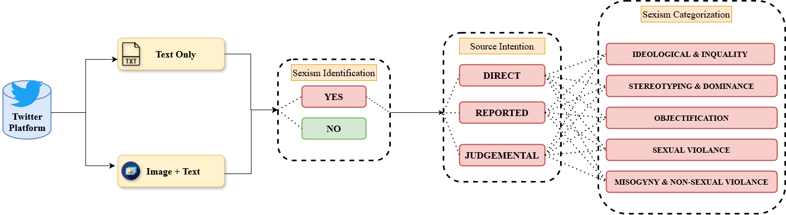
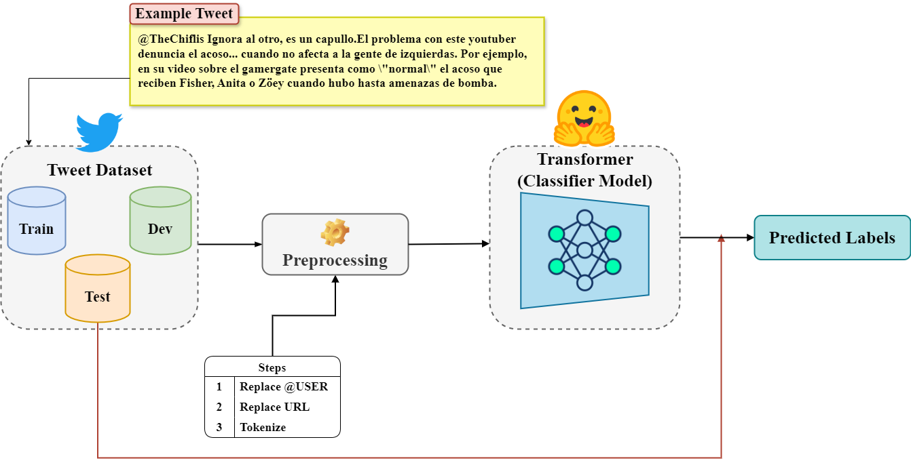
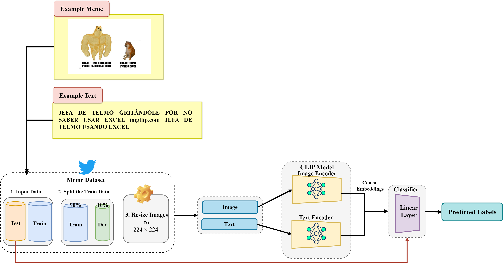

# NICA at CLEF EXIST 2024: Sexism Detection in Tweets and Memes with Multilingual Transformers and CLIP

## Overview

This repository contains the code for the **NICA** group's participation in the
[EXIST (sEXism Identification in Social neTworks) Shared Task at CLEF 2024](https://exist2024.github.io/),
covering five of the six tasks:

| Task | Description | Modality | Type |
|------|-------------|----------|------|
| Task 1 | Sexism Identification in Tweets | Text | Binary classification |
| Task 2 | Source Intention in Tweets | Text | Multi-class classification |
| Task 3 | Sexism Categorization in Tweets | Text | Multi-label classification |
| Task 4 | Sexism Identification in Memes | Image + Text | Binary classification |
| Task 5 | Source Intention in Memes | Image + Text | Multi-class classification |

<p align="center">
  
</p>

### Key Results

- 🥈 **4th place** — Task 5 (Soft-Soft, All languages) · ICM-Soft Norm: 0.3370  
- **9th place** — Task 4 (Soft-Soft, All languages) · ICM-Soft Norm: 0.4299

---

## Approach

### Tasks 1–3 (Text / Tweets)
We fine-tuned multilingual transformer models using HuggingFace's Trainer API on English and Spanish tweets.

**Models evaluated:**
- `sdadas/xlm-roberta-large-twitter` (XLM-L-T)
- `google-bert/bert-base-multilingual-uncased` (BBMUC)
- `FacebookAI/xlm-roberta-base` (XLM-B)
- `distilbert/distilbert-base-multilingual-cased` (DBMLC)

**Pre-processing:** User handles replaced with `@USER`, URLs with `#HTTPURL`. Minimal further processing to preserve tweet characteristics.
<p align="center">
  
</p>
### Tasks 4–5 (Multimodal / Memes)
We used **CLIP** to jointly encode image and text embeddings, concatenated them, and passed them through a linear classifier.

- Task 4: `openai/clip-vit-base-patch32`
- Task 5: `openai/clip-vit-large-patch14`

Images were resized to 224×224 pixels. Data was split 90/10 for train/dev.
<p align="center">
  
</p>
---

## Hyperparameters

### Tasks 1–3

| Task | Run | Model | Epochs | Train BS | Eval BS | LR | Val F1 |
|------|-----|-------|--------|----------|---------|----|--------|
| 1 | 1 | XLM-L-T | 4 | 8 | 16 | 2e-5 | 0.8527 |
| 1 | 2 | BBMUC | 5 | 8 | 8 | 3e-5 | 0.8980 |
| 1 | 3 | DBMLC | 5 | 8 | 8 | 3e-5 | 0.7812 |
| 2 | 1 | XLM-L-T | 4 | 8 | 16 | 2e-5 | 0.4894 |
| 2 | 2 | BBMUC | 4 | 8 | 8 | 1e-5 | 0.7342 |
| 3 | 1 | XLM-L-T | 4 | 8 | 16 | 2e-5 | 0.5449 |
| 3 | 2 | BBMUC | 4 | 8 | 8 | 3e-5 | 0.5849 |

Weight decay: 0.01 for all runs.

---

## Repository Structure
```
├── code/               # Notebooks for Tasks 1–3 (tweet-based)
├── task5/              # Notebook for Task 5 (meme source intention)
├── submission/         # Final submission files
├── exist2024_format_val.py   # Validation formatting script
└── README.md
```

---

## Evaluation

The shared task uses the **Information Contrast Measure (ICM)** as its official metric, evaluated in two modes:

- **Hard-Hard**: system output vs. majority-vote gold label
- **Soft-Soft**: predicted probability distribution vs. annotator label distribution

Our best performances were on the multimodal tasks (4 & 5) using the Soft-Soft metric.

---

## Citation

If you use this code, please cite our paper:
```bibtex
@inproceedings{naebzadeh-etal-2024-nica,
  title     = {NICA at EXIST CLEF Tasks 2024},
  author    = {Naebzadeh, Aylin and Nobakhtian, Melika and Eetemadi, Sauleh},
  booktitle = {Working Notes of CLEF 2024 -- Conference and Labs of the Evaluation Forum},
  year      = {2024},
  address   = {Grenoble, France}
}
```
